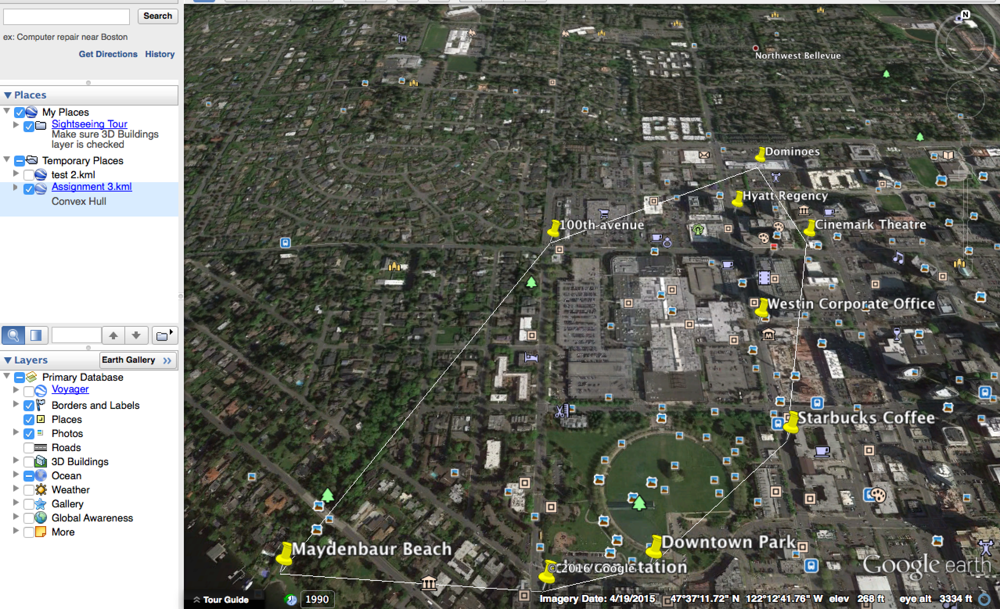

# Spatial-Database

This is my project for CS585 course - database systems. 

## Obtaining the points for quering 
Intially I collected nine points and created a [KML] (Placemark + Convex Hull.kml) using placemarks and providing the longitude
and latitude for each point. 
[KML](https://developers.google.com/kml/) is a file format used to display geographic data in an Earth browser such as Google Earth. 

## Visualizing the kml file on Google Earth

Then I downloaded the desktop version of Google Earth and opened the kml file in it. 

![Google Earth] (Google Earth.png)

## Creating Shape Files and visualising on ArcExplorer
I downloaded [Quantum GIS (QGIS)](http://www.qgis.org/en/site/) to convert the KML file to [shape files](Shape Files.zip). 
I then used the .zip file to visualize the points on ArcGIS Explorer. There is no desktop version of ArcGIS on MAC, so I used
[Online Version] (http://www.arcgis.com/home/webmap/viewer.html?useExisting=1) for viewing the particular file. 


## Adding the points in DB and querying
I used the Postgres+PostGIS to run spatial query on the data. The queries to create and insert the data are given in the [Queries](Queries.docx). 
There were 2 major queries that I executed. 

1) This was to create a convex hull of my points of interest.Convex Hull basically bounds the points in a convex. I used the [ST_ConvexHull](http://postgis.org/docs/ST_ConvexHull.html) to get the convex hull. 
I added the convex hull points in my orginal KML file to visualize it on Google Earth and it looked as follows:


2) The other query that I executed was to determine the three nearest neighbours from a particular point say Home. 
I queried this using the [<->](http://postgis.net/docs/geometry_distance_centroid.html) operator. 
This returns the 2D distance between the centroids of the bounding boxes of two geometries. The neighbours then again were added to the [KML](Nearest Neighbors.kml) file to visualize on Google Earth.


## Spirograph Image
Finally, I wrote a [java code](spiro.java) to find the points around a point in the form of a [Spirograph](https://www.google.com/search?q=Spirograph+curve&ie=utf-8&oe=utf-8). I used the following formula for Spirograph points:
```
x(t) = (R+r)*cos((r/R)*t) - a*cos((1+r/R)*t)
y(t) = (R+r)*sin((r/R)*t) - a*sin((1+r/R)*t)
```
with
`R=5, r=1 and a=4`

After finding the points, I created a [Spiro KML](spiro.kml) file and visualized on Google Earth. 

